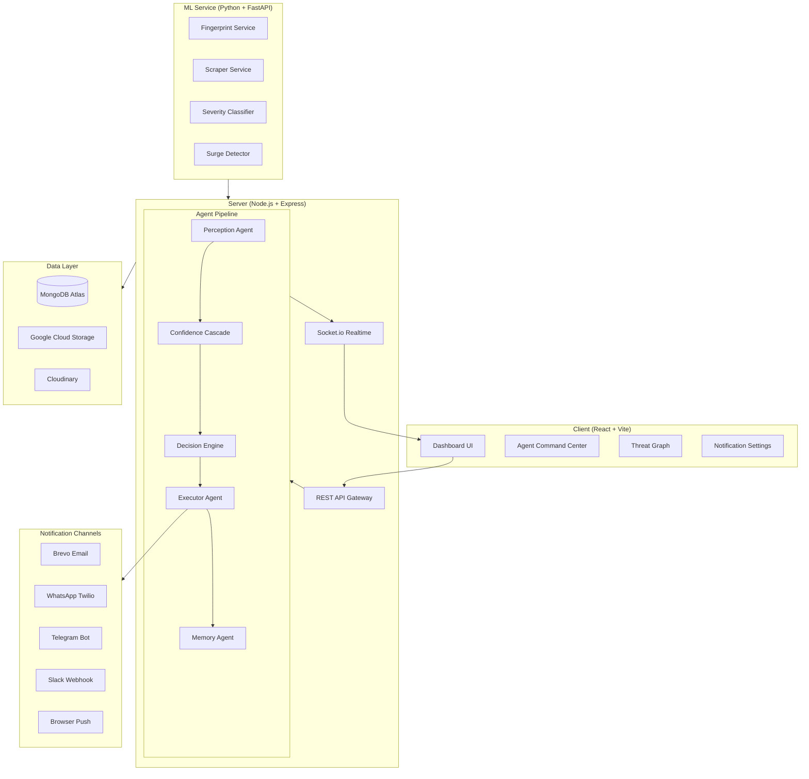

# Piractrix System Architecture

This document details the engineering layout, data pipelines, and system topology of the Piractrix Digital Rights Protection platform.

---

## Technical Overview

Piractrix operates on a decoupled architecture comprising a high-performance **React + Vite** single-page application, an asynchronous **Node.js Express** backend acting as orchestrator, and a **Python FastAPI** service handling fingerprinting and scraper nodes.

### System Diagram

---

## Core Layers

### 1. Unified Client Interface
The frontend is constructed using React 19 and Vite. The design incorporates Outfit/Inter typography, dynamic glassmorphic card layouts, responsive sidebar navigation, and native CSS/SVG animations.
Key features include:
- **Agent Command Center:** A central grid rendering active case cards and real-time socket traces.
- **Threat Graph:** Interactive SVG force-directed node visualization mapping pirate domain structures.
- **Predictions Panel:** Zero-day forecast charts pulling from historical model trends.

### 2. Orchestration Server
A Node.js Express server manages:
- **Asynchronous Agent Scheduling:** Cron-driven triggers running scan routines and publishing telemetry heartbeats.
- **Socket telemetry routing:** Transmitting status events org-by-org via JWT room scoping.
- **Evidence Management:** Linking database schemas with timeline audits, DMCA notices, and notification delivery receipts.

### 3. Machine Learning & Fingerprint Engine
FastAPI hosts our microservices:
- **ColorDNA & pHash:** Transforming video frames/images into immutable 64-bit fingerprint keys.
- **Scraper Nodes:** Bypassing API rate-limits to perform structured queries across YouTube, X/Twitter, Telegram channels, and standard web crawlers.
- **Gemini Severity Classifier:** Classifying content threat level and drafting legal templates.

### 4. Storage & Multi-Channel Notifications
- **MongoDB Atlas:** Persisting configurations, threat histories, and metrics.
- **Delivery Webhooks:** Dispatching notifications via WhatsApp (Twilio), Telegram API, Slack webhooks, email (Brevo), and standard browser web push.
