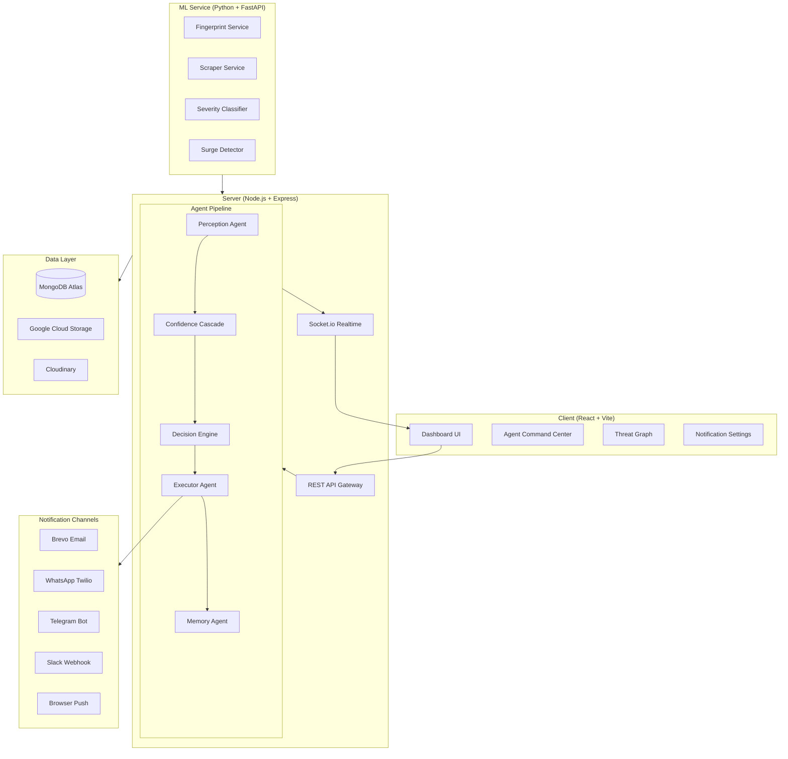

# PIRACTRIX — INTERNATIONAL HACKATHON MASTER BUILD PLAN
### Full Next-Level Agentic Product: Phase-wise Engineering Plan
**Team:** Esc(Reality); | **Event:** FAR AWAY 2026 | **Theme:** Agentic & Autonomous Systems

---

## CURRENT STATE — HONEST INVENTORY

Before building, understand exactly what's real, what's hollow, and what's missing.

**Real and working:**
- Firebase auth + JWT refresh token flow
- Asset upload → fingerprint pipeline (pHash + colorDNA + video frames)
- ML scraper across YouTube / Twitter / Telegram / Web
- Confidence Cascade (3 stages: keyword filter → fingerprint → vision verify)
- Gemini severity classifier + DMCA drafter
- Violation storage + alert creation
- Brevo email for high-confidence violations
- Socket.io connection with org-scoped rooms
- AgentDecisionLog model + ThreatMemory model
- Analytics charts + PDF report generation

**Broken / fake:**
- `DashboardHomePage` live log = `Math.random()` every 2.5s. 100% fabricated.
- Socket emits only `{ violationId, action, reasoning }` — no trace, no cascade data
- Executor: `auto_escalate` does nothing. `queue_review` = same as `create_alert`
- DMCA draft never updates the violation's status (still shows "Open" after agent acts)
- Perception agent changes scan frequency silently — never emits to frontend
- Organization has no WhatsApp / Telegram / Slack fields
- No case management lifecycle on violations
- No step-by-step agent trace visible anywhere in the UI
- Every agent action result = a toast that disappears in 4 seconds

---

## PHASE 0 — FOUNDATION: FIX WHAT'S BROKEN FIRST

> These are trust-killers. Fix before building anything new.

---

### 0.1 — Delete Fake Homepage Logs

**File:** `client/src/pages/dashboard/DashboardHomePage.jsx`

Delete the entire `useEffect` block that generates `Math.random()` logs (lines 42–68 approximately). Replace with a real WebSocket listener:

```js
useEffect(() => {
  if (!accessToken) return;
  const socket = connectRealtime(accessToken);
  if (!socket) return;

  socket.on('agent:decision', (payload) => {
    const { decision } = payload;
    if (!decision) return;
    setLiveLogs(prev => [{
      id: decision.logId || Date.now(),
      platform: decision.trace?.platform || decision.input?.platform || 'web',
      text: decision.trace?.cascadeStages
        ? `[CASCADE] Stage 3 passed — ${decision.trace?.classifierResult?.severity ? `SEV ${decision.trace.classifierResult.severity}` : 'classified'}`
        : (decision.reasoning?.slice(0, 90) || 'Agent decision processed'),
      time: new Date().toLocaleTimeString([], { hour: '2-digit', minute: '2-digit', second: '2-digit' }),
      action: decision.action,
      severity: decision.trace?.classifierResult?.severity || null,
      isReal: true,
    }, ...prev].slice(0, 6));
  });

  socket.on('agent:perception', (payload) => {
    if (!payload?.event) return;
    setLiveLogs(prev => [{
      id: Date.now(),
      platform: 'PERCEPTION',
      text: payload.event.triggeredBy || 'Asset scan frequency updated',
      time: new Date().toLocaleTimeString([], { hour: '2-digit', minute: '2-digit', second: '2-digit' }),
      action: 'perception_change',
      isPerception: true,
    }, ...prev].slice(0, 6));
  });

  return () => {
    socket.off('agent:decision');
    socket.off('agent:perception');
  };
}, [accessToken]);
```

When `liveLogs` is empty (agent idle), show a clean idle state: a pulsing dot with "PIRACTRIX ONLINE — Monitoring N assets. No threats queued." Not fake entries.

---

### 0.2 — Enrich Socket Emit: Full Trace Payload

**File:** `server/src/config/socket.js`

Upgrade `emitAgentDecision` to emit the full trace:

```js
export function emitAgentDecision({ orgId, decision }) {
  if (!io) return;
  io.to(getSocketRoom(orgId)).emit('agent:decision', { decision });
}

export function emitAgentPerception({ orgId, event }) {
  if (!io) return;
  io.to(getSocketRoom(orgId)).emit('agent:perception', { event });
}

export function emitAgentHeartbeat({ orgId, status }) {
  if (!io) return;
  io.to(getSocketRoom(orgId)).emit('agent:heartbeat', { status, ts: new Date().toISOString() });
}

export function emitEnforcementExecuted({ orgId, enforcement }) {
  if (!io) return;
  io.to(getSocketRoom(orgId)).emit('agent:enforcement', { enforcement });
}
```

**File:** `server/src/agents/orchestrator.agent.js`

After step 7 (emitting), pass the full payload:

```js
emitAgentDecision({
  orgId: violation.orgId || orgId,
  decision: {
    logId: savedLog._id,
    violationId: violation._id,
    action: decision.action,
    reasoning: decision.reasoning,
    autonomousMode: decision.autonomousMode,
    outcome: execResult?.outcome || 'pending',
    input: payload,
    trace: {
      platform: violation.platform,
      matchConfidence: violation.matchConfidence,
      cascadeStages: severityResult?.meta?.cascade?.stages || [],
      classifierResult: {
        severity: severityResult?.severity,
        threatCategory: severityResult?.threatCategory,
      },
      threatMemoryHit: Boolean(threatEntry),
      repeatOffenderCount: threatEntry?.totalViolations || 0,
      decisionRule: `sev_${severityResult?.severity}_rule${threatEntry ? '+repeat_offender' : ''}`,
      totalMs: execResult?.totalMs || null,
    },
    executionResult: execResult,
    timestamp: new Date().toISOString(),
  }
});
```

Save the AgentDecisionLog BEFORE emitting so you can include `savedLog._id` in the socket payload.

---

### 0.3 — Upgrade Violation Model

**File:** `server/src/models/violation.model.js`

Add inside the schema before `timestamps`:

```js
caseStatus: {
  type: String,
  enum: ['open', 'agent_reviewing', 'dmca_drafted', 'dmca_sent', 'takedown_requested', 'resolved', 'false_positive'],
  default: 'open',
  index: true,
},
caseId: {
  type: String,
  default: null, // PIR-YYYYMMDD-XXXX
},
dmcaContent: {
  type: String,
  default: null,
},
dmcaContactEmail: {
  type: String,
  default: null,
},
dmcaGeneratedAt: {
  type: Date,
  default: null,
},
dmcaGeneratedBy: {
  type: String,
  enum: ['gemini', 'template', null],
  default: null,
},
agentDecisionId: {
  type: mongoose.Schema.Types.ObjectId,
  ref: 'AgentDecisionLog',
  default: null,
},
caseTimeline: [{
  event: String,       // 'detected', 'agent_classified', 'dmca_drafted', 'notified', 'takedown_sent'
  description: String,
  timestamp: { type: Date, default: Date.now },
  meta: mongoose.Schema.Types.Mixed,
}],
```

---

### 0.4 — Upgrade Organization Model

**File:** `server/src/models/organization.model.js`

Expand `notificationPrefs`:

```js
notificationPrefs: {
  emailOnHighConfidence: { type: Boolean, default: true },
  emailDigest: { type: Boolean, default: false },
  inAppAlerts: { type: Boolean, default: true },
  // NEW — multi-channel
  whatsappEnabled: { type: Boolean, default: false },
  whatsappNumber: { type: String, default: null },     // E.164 format e.g. +919876543210
  telegramEnabled: { type: Boolean, default: false },
  telegramChatId: { type: String, default: null },
  slackEnabled: { type: Boolean, default: false },
  slackWebhookUrl: { type: String, default: null },
  pushEnabled: { type: Boolean, default: false },
  pushSubscription: { type: mongoose.Schema.Types.Mixed, default: null },
  // Alert threshold
  alertMinSeverity: { type: Number, default: 3, min: 1, max: 5 },
  whatsappMinSeverity: { type: Number, default: 5 },
},
```

---

### 0.5 — Add Trace Endpoint

**File:** `server/src/routes/agent.route.js`

Add:
```js
router.get('/decisions/:id/trace', agentController.getDecisionTrace);
```

**File:** `server/src/controllers/agent.controller.js`

Add `getDecisionTrace`:
```js
export async function getDecisionTrace(req, res, next) {
  try {
    const { id } = req.params;
    const log = await AgentDecisionLog.findOne({ _id: id, orgId: req.org._id })
      .populate('violationId', 'platform matchConfidence sourceUrl matchType evidenceBundle caseStatus caseTimeline')
      .populate('assetId', 'title type')
      .lean();
    if (!log) return res.status(404).json({ message: 'Decision not found' });

    // Build step-by-step trace from meta
    const cascade = log.meta?.severityResult?.meta?.cascade || {};
    const steps = [
      { step: 1, name: 'keyword_filter', label: 'Keyword Quality Filter', passed: cascade.stages?.[0]?.passed ?? true, value: cascade.stages?.[0]?.score ? `${cascade.stages[0].score}/100` : 'N/A', ms: cascade.stages?.[0]?.ms || 0 },
      { step: 2, name: 'fingerprint_match', label: 'Fingerprint Match', passed: cascade.stages?.[1]?.passed ?? true, value: `${log.input?.confidence || 0}% confidence`, ms: cascade.stages?.[1]?.ms || 0 },
      { step: 3, name: 'vision_verify', label: 'Vision Verify', passed: cascade.stages?.[2]?.passed ?? (log.violationId?.evidenceBundle?.visionConfidenceBoost > 0), value: log.violationId?.evidenceBundle?.visionConfidenceBoost ? `+${log.violationId.evidenceBundle.visionConfidenceBoost}% boost` : 'Not triggered', ms: cascade.stages?.[2]?.ms || 0 },
      { step: 4, name: 'gemini_classify', label: 'Severity Classification (Gemini)', passed: true, value: `SEV ${log.meta?.severityResult?.severity || '?'} — ${log.meta?.severityResult?.threatCategory || 'unknown'}`, ms: 1200 },
      { step: 5, name: 'threat_memory', label: 'Threat Memory Lookup', passed: true, value: log.meta?.severityResult ? (log.meta.execResult?.details?.repeatOffenderCount ? `${log.meta.execResult.details.repeatOffenderCount} prior violations from domain` : 'New domain — no prior history') : 'N/A', ms: 40 },
      { step: 6, name: 'decision_engine', label: 'Action Decision', passed: true, value: `${log.action} (${log.meta?.severityResult?.decisionRule || 'rule engine'})`, ms: 0 },
      { step: 7, name: 'execution', label: 'Action Executed', passed: log.outcome === 'success', value: log.outcome === 'success' ? `${log.action} completed` : `Failed: ${log.meta?.execResult?.error || 'unknown'}`, ms: log.meta?.execResult?.totalMs || 80 },
      { step: 8, name: 'notification', label: 'Rights Holder Notified', passed: log.meta?.execResult?.notified !== false, value: log.meta?.execResult?.channels?.join(', ') || 'email', ms: 60 },
    ];

    res.json({ steps, reasoning: log.reasoning, violation: log.violationId, asset: log.assetId, decision: log });
  } catch (err) { next(err); }
}
```

---

### 0.6 — Enrich Agent Status Endpoint

**File:** `server/src/controllers/agent.controller.js` → `getStatus`

Return rich status:
```js
const [agentDoc, assetCount, pendingDecisions, lastDecision] = await Promise.all([
  AgentStatus.findOne({ orgId: req.org._id }).lean(),
  Asset.countDocuments({ orgId: req.org._id }),
  AgentDecisionLog.countDocuments({ orgId: req.org._id, outcome: 'pending' }),
  AgentDecisionLog.findOne({ orgId: req.org._id }).sort({ createdAt: -1 }).lean(),
]);

res.json({
  autonomousMode: agentDoc?.autonomousMode || false,
  status: agentDoc?.autonomousMode ? 'active' : 'assisted',
  lastRun: agentDoc?.lastRun,
  lastAction: lastDecision ? { action: lastDecision.action, timestamp: lastDecision.createdAt } : null,
  protectedAssets: assetCount,
  queuedDecisions: pendingDecisions,
  heartbeat: agentDoc?.lastHeartbeat || null,
  channels: {
    email: Boolean(req.org.notificationPrefs?.emailOnHighConfidence),
    whatsapp: Boolean(req.org.notificationPrefs?.whatsappEnabled && req.org.notificationPrefs?.whatsappNumber),
    telegram: Boolean(req.org.notificationPrefs?.telegramEnabled && req.org.notificationPrefs?.telegramChatId),
    slack: Boolean(req.org.notificationPrefs?.slackEnabled && req.org.notificationPrefs?.slackWebhookUrl),
  }
});
```

---

## PHASE 1 — COMPLETE THE AGENT BACKEND

---

### 1.1 — Complete the Executor: Real Actions

**File:** `server/src/agents/executor.agent.js`

Rewrite completely:

```js
import { createAlertFromViolation } from '../services/alerts.service.js';
import { draftDmcaNotice } from '../services/violations.service.js';
import { sendViolationAlertEmail } from '../services/email.service.js';
import { sendWhatsAppAlert } from '../services/whatsapp.service.js';
import { sendTelegramAlert } from '../services/telegram.service.js';
import { sendSlackAlert } from '../services/slack.service.js';
import Violation from '../models/violation.model.js';
import Organization from '../models/organization.model.js';
import { generateCaseId } from '../utils/caseId.js';

async function notifyAllChannels({ org, violation, dmcaDraft, severity, action }) {
  const channels = [];
  const prefs = org.notificationPrefs || {};
  const minSev = prefs.alertMinSeverity || 3;

  if (severity < minSev) return { channels };

  // Email (always if enabled)
  if (prefs.emailOnHighConfidence && org.email) {
    try {
      await sendViolationAlertEmail(org.email, violation);
      channels.push('email');
    } catch (e) { console.warn('[executor] email failed:', e.message); }
  }

  // WhatsApp (for high severity)
  if (prefs.whatsappEnabled && prefs.whatsappNumber && severity >= (prefs.whatsappMinSeverity || 5)) {
    try {
      await sendWhatsAppAlert({ to: prefs.whatsappNumber, org, violation, dmcaDraft, severity });
      channels.push('whatsapp');
    } catch (e) { console.warn('[executor] whatsapp failed:', e.message); }
  }

  // Telegram
  if (prefs.telegramEnabled && prefs.telegramChatId) {
    try {
      await sendTelegramAlert({ chatId: prefs.telegramChatId, violation, severity, action });
      channels.push('telegram');
    } catch (e) { console.warn('[executor] telegram failed:', e.message); }
  }

  // Slack
  if (prefs.slackEnabled && prefs.slackWebhookUrl) {
    try {
      await sendSlackAlert({ webhookUrl: prefs.slackWebhookUrl, violation, severity, action, dmcaDraft });
      channels.push('slack');
    } catch (e) { console.warn('[executor] slack failed:', e.message); }
  }

  return { channels };
}

export async function executeAction({ orgId, violationId, action, severity = 3, agentDecisionId = null }) {
  const start = Date.now();
  try {
    const [violation, org] = await Promise.all([
      Violation.findById(violationId).lean(),
      Organization.findById(orgId).lean(),
    ]);
    if (!violation) return { outcome: 'failed', error: 'Violation not found' };

    const caseId = violation.caseId || generateCaseId();
    const timelineBase = { timestamp: new Date() };

    if (action === 'log_only') {
      return { outcome: 'skipped', details: { reason: 'severity_below_threshold' } };
    }

    if (action === 'create_alert') {
      const alerts = await createAlertFromViolation({ orgId, violationId, platform: violation.platform, matchConfidence: violation.matchConfidence });
      await Violation.findByIdAndUpdate(violationId, {
        caseStatus: 'agent_reviewing',
        caseId,
        agentDecisionId,
        $push: { caseTimeline: { ...timelineBase, event: 'agent_classified', description: `Agent reviewed and created alert. Confidence: ${violation.matchConfidence}%` } }
      });
      const { channels } = await notifyAllChannels({ org, violation, severity, action });
      return { outcome: 'success', details: { alertsCount: alerts.length, channels, caseId }, totalMs: Date.now() - start };
    }

    if (action === 'queue_review') {
      await Violation.findByIdAndUpdate(violationId, {
        caseStatus: 'agent_reviewing',
        caseId,
        agentDecisionId,
        $push: { caseTimeline: { ...timelineBase, event: 'queued_review', description: 'Agent queued for human review. Confidence borderline or new domain.' } }
      });
      await createAlertFromViolation({ orgId, violationId, platform: violation.platform, matchConfidence: violation.matchConfidence });
      return { outcome: 'pending', details: { queued: true, caseId }, totalMs: Date.now() - start };
    }

    if (action === 'draft_dmca' || action === 'auto_escalate') {
      const draft = await draftDmcaNotice({ orgId, violationId });

      await Violation.findByIdAndUpdate(violationId, {
        caseStatus: 'dmca_drafted',
        caseId,
        agentDecisionId,
        dmcaContent: draft.draft,
        dmcaContactEmail: draft.contactEmail,
        dmcaGeneratedAt: new Date(),
        dmcaGeneratedBy: draft.generatedBy,
        $push: { caseTimeline: { ...timelineBase, event: 'dmca_drafted', description: `DMCA notice drafted by ${draft.generatedBy === 'gemini' ? 'Gemini AI' : 'template'}. Contact: ${draft.contactEmail}`, meta: { contactEmail: draft.contactEmail } } }
      });

      const { channels } = await notifyAllChannels({ org, violation: { ...violation, caseId }, dmcaDraft: draft, severity, action });

      if (channels.length > 0) {
        await Violation.findByIdAndUpdate(violationId, {
          $push: { caseTimeline: { ...timelineBase, event: 'notified', description: `Rights holder notified via: ${channels.join(', ')}` } }
        });
      }

      // For auto_escalate: also create a critical alert
      if (action === 'auto_escalate') {
        await createAlertFromViolation({ orgId, violationId, platform: violation.platform, matchConfidence: violation.matchConfidence });
      }

      return {
        outcome: 'success',
        details: { draft, channels, caseId, notified: channels.length > 0 },
        totalMs: Date.now() - start,
        channels,
      };
    }

    return { outcome: 'skipped', totalMs: Date.now() - start };
  } catch (error) {
    console.error('[executor] executeAction error:', error);
    return { outcome: 'failed', error: error?.message || String(error), totalMs: Date.now() - start };
  }
}
```

---

### 1.2 — CaseId Utility

**New file:** `server/src/utils/caseId.js`

```js
export function generateCaseId() {
  const date = new Date();
  const dateStr = `${date.getFullYear()}${String(date.getMonth()+1).padStart(2,'0')}${String(date.getDate()).padStart(2,'0')}`;
  const rand = Math.random().toString(36).substring(2, 6).toUpperCase();
  return `PIR-${dateStr}-${rand}`;
}
```

---

### 1.3 — Perception Agent: Emit Events

**File:** `server/src/agents/perception.agent.js`

After changing scan frequency, emit:
```js
import { emitAgentPerception, emitAgentHeartbeat } from '../config/socket.js';

// At the end of the perception run, emit heartbeat
emitAgentHeartbeat({ orgId, status: { assetsChecked, highRiskCount, scheduledCount } });

// When upgrading an asset
emitAgentPerception({ orgId, event: {
  type: 'scan_frequency_upgraded',
  assetId: asset._id,
  assetTitle: asset.title,
  reason: 'high_violation_count',
  newFrequency: '2h',
  previousFrequency: '24h',
  triggeredBy: `${recentViolations} violations in last 72h`,
  timestamp: new Date().toISOString(),
}});
```

---

### 1.4 — WhatsApp Service (Twilio)

**New file:** `server/src/services/whatsapp.service.js`

```js
let twilioClient = null;
function getClient() {
  if (!twilioClient && process.env.TWILIO_ACCOUNT_SID && process.env.TWILIO_AUTH_TOKEN) {
    const twilio = await import('twilio');
    twilioClient = twilio.default(process.env.TWILIO_ACCOUNT_SID, process.env.TWILIO_AUTH_TOKEN);
  }
  return twilioClient;
}

export async function sendWhatsAppAlert({ to, org, violation, dmcaDraft, severity }) {
  const client = getClient();
  if (!client) { console.warn('[whatsapp] Twilio not configured'); return false; }

  const sevEmoji = severity >= 5 ? '🚨' : severity >= 4 ? '⚠️' : 'ℹ️';
  const message = severity >= 5
    ? `${sevEmoji} *PIRACTRIX CRITICAL*\n\n` +
      `Your content was found on *${violation.platform.toUpperCase()}*\n` +
      `Match: *${violation.matchConfidence}%* confidence\n` +
      `Type: ${violation.matchType}\n` +
      `Case ID: \`${violation.caseId || 'PIR-PENDING'}\`\n\n` +
      `✅ DMCA auto-drafted\n` +
      `Target: ${dmcaDraft?.contactEmail || 'platform abuse team'}\n\n` +
      `*Reply APPROVE to send DMCA immediately*\n` +
      `View case: ${process.env.CLIENT_URL}/dashboard/violations/${violation._id}`
    : `${sevEmoji} *PIRACTRIX ALERT*\n\n` +
      `Potential violation on *${violation.platform}*\n` +
      `Confidence: ${violation.matchConfidence}%\n` +
      `Review: ${process.env.CLIENT_URL}/dashboard/violations/${violation._id}`;

  await client.messages.create({
    from: `whatsapp:${process.env.TWILIO_WHATSAPP_NUMBER}`,
    to: `whatsapp:${to}`,
    body: message,
  });
  return true;
}
```

Install: `npm install twilio` in server.

---

### 1.5 — Telegram Bot Service

**New file:** `server/src/services/telegram.service.js`

```js
let bot = null;

function getBot() {
  if (!bot && process.env.TELEGRAM_BOT_TOKEN) {
    import('telegraf').then(({ Telegraf }) => {
      bot = new Telegraf(process.env.TELEGRAM_BOT_TOKEN);
    });
  }
  return bot;
}

export async function sendTelegramAlert({ chatId, violation, severity, action }) {
  const b = getBot();
  if (!b || !chatId) return false;

  const emoji = severity >= 5 ? '🚨' : severity >= 4 ? '⚠️' : 'ℹ️';
  const text =
    `${emoji} *Piractrix Agent Alert*\n\n` +
    `Platform: \`${violation.platform}\`\n` +
    `Confidence: \`${violation.matchConfidence}%\`\n` +
    `Match Type: \`${violation.matchType}\`\n` +
    `Action taken: \`${action?.replace(/_/g, ' ')}\`\n` +
    `Case: \`${violation.caseId || 'pending'}\`\n\n` +
    `[View in Dashboard](${process.env.CLIENT_URL}/dashboard/violations/${violation._id})`;

  await b.telegram.sendMessage(chatId, text, {
    parse_mode: 'Markdown',
    disable_web_page_preview: true,
  });
  return true;
}
```

Install: `npm install telegraf` in server.

---

### 1.6 — Slack Webhook Service

**New file:** `server/src/services/slack.service.js`

```js
export async function sendSlackAlert({ webhookUrl, violation, severity, action, dmcaDraft }) {
  if (!webhookUrl) return false;

  const color = severity >= 5 ? '#E24B4A' : severity >= 4 ? '#BA7517' : '#3B8BD4';
  const body = {
    attachments: [{
      color,
      blocks: [
        { type: 'header', text: { type: 'plain_text', text: `${severity >= 5 ? '🚨' : '⚠️'} Piractrix Alert — ${action?.replace(/_/g, ' ').toUpperCase()}` } },
        { type: 'section', fields: [
          { type: 'mrkdwn', text: `*Platform:*\n${violation.platform}` },
          { type: 'mrkdwn', text: `*Confidence:*\n${violation.matchConfidence}%` },
          { type: 'mrkdwn', text: `*Match Type:*\n${violation.matchType}` },
          { type: 'mrkdwn', text: `*Severity:*\nSEV ${severity}` },
        ]},
        { type: 'section', text: { type: 'mrkdwn', text: `*Case ID:* \`${violation.caseId || 'PIR-PENDING'}\`` } },
        { type: 'actions', elements: [{
          type: 'button', style: 'primary',
          text: { type: 'plain_text', text: 'View Case' },
          url: `${process.env.CLIENT_URL}/dashboard/violations/${violation._id}`
        }]}
      ]
    }]
  };

  await fetch(webhookUrl, { method: 'POST', headers: { 'Content-Type': 'application/json' }, body: JSON.stringify(body) });
  return true;
}
```

---

### 1.7 — Piracy Prediction Endpoint

**New file in routes:** `GET /api/agent/predict`

**Controller:**
```js
export async function getPrediction(req, res, next) {
  try {
    const { assetId, eventName, broadcastTime } = req.query;
    const asset = assetId ? await Asset.findOne({ _id: assetId, orgId: req.org._id }).lean() : null;

    // Historical pattern from org's violation data
    const orgViolations = await Violation.countDocuments({ orgId: req.org._id });
    const avgPerScan = await ScanJob.aggregate([
      { $match: { orgId: req.org._id, status: 'completed' } },
      { $group: { _id: null, avg: { $avg: '$violationsFound' } } }
    ]);

    // Call Gemini for prediction
    const geminiPrompt = `You are a piracy intelligence analyst. Based on historical data: ${orgViolations} total violations detected, ${avgPerScan[0]?.avg?.toFixed(1) || 2} violations per scan on average. The event is: "${eventName || asset?.title || 'sports broadcast'}". Expected broadcast: ${broadcastTime || 'tonight'}. Predict: 1) Number of piracy violations expected within 2h of broadcast 2) Peak violation hour 3) Top 3 platforms 4) Risk level (low/medium/high/critical). Respond ONLY in JSON: {"expectedViolations":N,"peakHour":N,"topPlatforms":["..."],"riskLevel":"...","confidence":"...%","reasoning":"..."}`;

    const geminiRes = await fetch(`https://generativelanguage.googleapis.com/v1beta/models/gemini-1.5-flash:generateContent?key=${process.env.GEMINI_API_KEY}`, {
      method: 'POST', headers: { 'Content-Type': 'application/json' },
      body: JSON.stringify({ contents: [{ parts: [{ text: geminiPrompt }] }] })
    });
    const geminiData = await geminiRes.json();
    const text = geminiData?.candidates?.[0]?.content?.parts?.[0]?.text || '{}';
    const prediction = JSON.parse(text.replace(/```json|```/g, '').trim());

    res.json({ prediction, asset: asset ? { title: asset.title, type: asset.type } : null, generatedAt: new Date().toISOString() });
  } catch (err) { next(err); }
}
```

---

### 1.8 — Agent Heartbeat Job

**File:** `server/src/jobs/scan.job.js`

Add a heartbeat every 5 minutes alongside the scan:
```js
// Heartbeat: agent announces it's alive
cron.schedule('*/5 * * * *', async () => {
  const orgs = await Organization.find({}).select('_id').lean();
  for (const org of orgs) {
    emitAgentHeartbeat({ orgId: org._id.toString(), status: { alive: true } });
  }
});
```

---

## PHASE 2 — AGENT UI: COMMAND CENTER REVOLUTION

---

### 2.1 — Global Agent Status Bar

**New file:** `client/src/components/AgentStatusBar.jsx`

A sticky strip rendered inside `DashboardLayout.jsx` just above the main content.

Visual states:

**State 1 — Autonomous + Connected:**
```
[ ● PIRACTRIX AGENT ] [AUTONOMOUS]  Monitoring 8 assets  |  Last action: 4m ago  |  Queued: 0  |  WhatsApp ✓  Email ✓
```
Background: very light violet tint `bg-violet-50/70 border-b border-violet-100`.

**State 2 — Processing:**
```
[ ⚙ PROCESSING ] Analyzing 3 violations from scan #8829...
```
Background: amber tint. Pulsing.

**State 3 — Manual / Awaiting Approval:**
```
[ ● MANUAL MODE ] 2 decisions await your approval  →  [ Review Now ]
```
Background: slate. Link goes to Agent Command Center.

**State 4 — Disconnected:**
```
[ ✕ AGENT OFFLINE ] WebSocket disconnected — reconnecting...
```

Powered by: `useAgentStatus` hook that:
1. Polls `GET /agent/status` every 30s
2. Listens to `agent:heartbeat` socket event
3. Listens to `agent:decision` to update "last action" time

---

### 2.2 — Agent Thinking Drawer

**New file:** `client/src/components/AgentThinkingDrawer.jsx`

A slide-over panel from the right side (NOT a modal, a slide-over). Shows automatically when:
- WebSocket fires `agent:decision` with `autonomousMode: true` AND `action !== 'log_only'`
- User clicks "Inspect" / "Trace" on any decision row
- User clicks a notification that links to a trace

The drawer loads the full trace from `GET /agent/decisions/:id/trace`.

**Visual design — dark terminal aesthetic:**
```
┌──────────────────────────────────────────────┐
│  🤖 AGENT REASONING TRACE           [×]      │
│  Decision #PIR-20260614-8KQT | 4.2s          │
│  Asset: IPL Final 2026 Highlights            │
├──────────────────────────────────────────────┤
│                                              │
│  ✓  01  KEYWORD FILTER             22ms     │
│       Quality: 74/100 → PASSED              │
│                                              │
│  ✓  02  FINGERPRINT MATCH         800ms     │
│       Hamming: 6 | Color: 0.79 | PASSED     │
│                                              │
│  ✓  03  VISION VERIFY            1,100ms    │
│       Google Vision +8% confidence boost    │
│                                              │
│  ✓  04  SEVERITY CLASSIFICATION  1,400ms    │
│       Gemini → SEV 4 | coordinated_repost   │
│       ↳ "Near-duplicate on YouTube from..." │
│                                              │
│  ✓  05  THREAT MEMORY             40ms     │
│       streamhd.xyz → 3 prior violations     │
│       → Repeat offender bonus applied       │
│                                              │
│  ✓  06  ACTION DECISION             0ms     │
│       queue_review → draft_dmca (boosted)   │
│                                              │
│  ✓  07  DMCA DRAFTED              800ms     │
│       Gemini AI | copyright@youtube.com     │
│       [ View Full DMCA ]                    │
│                                              │
│  ✓  08  CHANNELS NOTIFIED          60ms     │
│       ✉ Email | 💬 WhatsApp | ✓ Delivered   │
│                                              │
│  FULL REASONING ────────────────────────    │
│  "Near-duplicate detected on YouTube.       │
│   Domain streamhd.xyz has 3 prior          │
│   violations. Confidence 82% exceeded..."  │
└──────────────────────────────────────────────┘
```

Each step animates in from the left with a 200ms stagger. Steps that failed render in red with an `✕`.

**Implementation:**
- Global state via Zustand: `useAgentTraceStore` with `{ open, decisionId, data, loading }`
- `useEffect` in a wrapper that listens to `agent:decision` events and auto-opens when severity >= 4
- Calls `GET /agent/decisions/:id/trace` when opened
- Renders steps with staggered `animation-delay` CSS
- One `Drawer` base component to reuse

---

### 2.3 — Enforcement Evidence Modal

**New file:** `client/src/components/EnforcementEvidenceModal.jsx`

Triggered by: `agent:enforcement` socket event OR `agent:decision` with `action === 'draft_dmca'` AND autonomous mode.

```
╔═══════════════════════════════════════════════╗
║  ✅ AGENT ENFORCEMENT COMPLETE         [✕]   ║
║  Case #PIR-20260614-8KQT                      ║
╠═══════════════════════════════════════════════╣
║                                               ║
║  Asset:    IPL Final 2026 Highlights          ║
║  Platform: YouTube  |  SEV 5  |  Match: 82%  ║
║                                               ║
║  DMCA NOTICE PREVIEW ─────────────────────── ║
║  ┌─────────────────────────────────────────┐ ║
║  │ To: copyright@youtube.com               │ ║
║  │ Subject: Copyright Infringement Notice  │ ║
║  │                                         │ ║
║  │ This letter serves as notification of   │ ║
║  │ copyright infringement pursuant to the  │ ║
║  │ Digital Millennium Copyright Act...     │ ║
║  │ [Expand to see full notice]             │ ║
║  └─────────────────────────────────────────┘ ║
║                                               ║
║  CHANNELS NOTIFIED                            ║
║  ✉ Email → rights@yourorg.com   ✓ Sent       ║
║  💬 WhatsApp → +91XXXX          ✓ Delivered  ║
║  📋 Case opened at 14:32:07                  ║
║                                               ║
║  [  Send DMCA Now  ]   [ View Full Case ]     ║
╚═══════════════════════════════════════════════╝
```

This is the "receipt" for every autonomous enforcement action. It replaces the 4-second toast entirely.

---

### 2.4 — Command Center: Decision Cards (Not Table)

**File:** `client/src/pages/dashboard/AgentCommandCenterPage.jsx`

Replace the table-based decisions with expandable cards. Each card has two states:

**Collapsed:**
```
┌────────────────────────────────────────────────────────┐
│ [SEV 5] [CRITICAL]  draft_dmca  AUTONOMOUS  ✓SUCCESS   │
│ YouTube • 82% • streamhd.xyz • 14:32:07     [Expand ↓] │
└────────────────────────────────────────────────────────┘
```

**Expanded (smooth height animation on click):**
```
┌────────────────────────────────────────────────────────┐
│ [SEV 5] [CRITICAL]  draft_dmca  AUTONOMOUS  ✓SUCCESS   │
│ YouTube • 82% • streamhd.xyz • 14:32:07     [Collapse] │
├─────────────────────────────────────────────────────────┤
│ REASONING                                               │
│ "Near-duplicate detected on YouTube from repeat         │
│  offender domain. 82% confidence post-vision boost.     │
│  DMCA auto-drafted targeting copyright@youtube.com."    │
├─────────────────────────────────────────────────────────┤
│ CASCADE  ✓ keyword  ✓ fingerprint  ✓ vision             │
│ MEMORY   streamhd.xyz → 3 violations → HIGH threat      │
├─────────────────────────────────────────────────────────┤
│ Case: PIR-20260614-8KQT                                 │
│ [View Full Trace]  [View DMCA Draft]  [View Violation]  │
└─────────────────────────────────────────────────────────┘
```

---

### 2.5 — Discovery Telemetry: Real Terminal

**File:** `client/src/pages/dashboard/AgentCommandCenterPage.jsx`

Replace the basic dark panel with a proper terminal-style component. Real socket events stream in with platform-specific colored dots:

- `youtube` → red dot
- `telegram` → teal dot  
- `web` → blue dot
- `twitter` → sky dot
- `PERCEPTION` → violet dot

Each line uses monospace font and animates in from the bottom (like a real terminal, new entries push old ones up, not prepend at top).

When idle (no socket events for >30s), show a breathing status line:
```
● piractrix-agent v1.0 running | 8 assets watched | awaiting scan results...
```

The terminal has a small header bar with colored dots (macOS style) and a title "PIRACTRIX AGENT TERMINAL".

---

### 2.6 — Autonomous Mode Toggle: Premium UX

**File:** `client/src/pages/dashboard/AgentCommandCenterPage.jsx`

When turning ON autonomous mode for the first time in a session, show a confirmation:

```
╔════════════════════════════════════════════╗
║  Enable Autonomous Mode?                  ║
║                                           ║
║  When active, ShieldAgent will:           ║
║  • Draft DMCA notices automatically       ║
║  • Notify you via all configured channels  ║
║  • Act on violations without approval     ║
║                                           ║
║  You can disable this anytime.            ║
║                                           ║
║  [ Cancel ]    [ Enable Autonomous Mode ] ║
╚════════════════════════════════════════════╝
```

The toggle itself should have a satisfying animation — it's not just a boolean switch, it's the most important button in the product. Make it large, with the label "AUTO-DEFENSE: OFF → ON" and a shield icon that animates when enabling.

---

## PHASE 3 — VIOLATION CASE MANAGEMENT

---

### 3.1 — Case Status Badge System

**File:** `client/src/pages/dashboard/DashboardViolationsPage.jsx`

Replace the simple `status` badge with a rich `caseStatus` progression badge:

| caseStatus | Color | Label |
|---|---|---|
| `open` | slate | Open |
| `agent_reviewing` | violet | Agent Reviewing |
| `dmca_drafted` | amber | DMCA Drafted |
| `dmca_sent` | orange | DMCA Sent |
| `takedown_requested` | blue | Takedown Requested |
| `resolved` | green | Resolved |
| `false_positive` | red | False Positive |

This is data already in the model (after Phase 0.3) — just add the UI.

---

### 3.2 — Violation Detail: Case Timeline

**New component:** `client/src/components/CaseTimeline.jsx`

Used on the Violations detail view. Renders the `caseTimeline` array from the violation:

```
CASE TIMELINE
────────────────────────────────────────────────────
●  14:28:01  Detected by scan job #8829
             YouTube | Confidence: 78% | near-duplicate

●  14:32:07  Agent analyzed & classified
             SEV 4 | coordinated_repost | cascade: all passed

●  14:32:08  DMCA drafted by Gemini AI
             Contact: copyright@youtube.com

●  14:32:09  Rights holder notified
             Email + WhatsApp delivered

⬜  Pending   Takedown confirmation
────────────────────────────────────────────────────
Case ID: PIR-20260614-8KQT
[ View Agent Reasoning Trace ]  [ Send DMCA Now ]
```

Vertical timeline with connecting line. Each item has a timestamp, event icon (shield, bot, envelope, check), and description.

---

### 3.3 — DMCA Preview Drawer

**New component:** `client/src/components/DmcaPreviewDrawer.jsx`

When the violation has `caseStatus === 'dmca_drafted'`, show a "View DMCA Draft" button. Clicking it opens a full-screen drawer with:

- DMCA header (To, Subject, Case ID)
- Full DMCA body text in a scrollable area
- "Copy Text" button
- "Send Now" button (marks violation as `dmca_sent`, emits event)
- "Mark as Sent Manually" button

The DMCA text is stored in `violation.dmcaContent` — it's already drafted by Gemini in the executor. Just display it.

---

### 3.4 — Violations Page: Case ID Column

**File:** `client/src/pages/dashboard/DashboardViolationsPage.jsx`

Add a `Case ID` column to the violations table. Clicking the case ID opens the full case view.

Also add a filter bar above the table:
- Status filter (dropdown: all / open / agent_reviewing / dmca_drafted / resolved)
- Platform filter
- Severity filter
- "Show DMCA-ready" quick filter button

---

## PHASE 4 — NOTIFICATION HUB

---

### 4.1 — Notification Settings Page

**New file:** `client/src/pages/dashboard/NotificationSettingsPage.jsx`

A full-page settings UI:

```
NOTIFICATION CHANNELS
──────────────────────────────────────────────────

Email (Primary)                         ✓ Connected
  rights@yourorg.com
  Alert threshold: SEV 3+
  [ Edit ]

WhatsApp                                [ Connect ]
  Enter phone number in E.164 format (+919876543210)
  Send verification code → enter code → connected
  Alert threshold: SEV 5 (critical only)
  [ Save Number ]

Telegram                                [ Connect ]
  Start @PiractrixBot on Telegram
  Your chat ID: [auto-detected after /start]
  [ Connect Bot ]

Slack                                   [ Connect ]
  Webhook URL from Slack app settings
  Test: [ Send Test Message ]
  [ Save Webhook ]

Browser Push                            [ Enable ]
  Receive alerts even when tab is closed
  [ Enable Push Notifications ]

──────────────────────────────────────────────────

ALERT PREFERENCES
□ Email on high-confidence (≥70%) violations
□ Email weekly digest (Monday 9am)
□ In-app alert badges
□ WhatsApp for critical threats only (SEV 5)
□ Include DMCA preview in WhatsApp

MIN SEVERITY TO TRIGGER:
[●––––] SEV 1   [–●–––] SEV 2   [––●––] SEV 3 ✓   [–––●–] SEV 4   [––––●] SEV 5
```

Saves to Organization `notificationPrefs` via `PATCH /api/org/notification-prefs`.

---

### 4.2 — Browser Push Notifications

**New file:** `server/src/services/push.service.js`

Using `web-push` npm package:
```js
import webpush from 'web-push';

webpush.setVapidDetails(
  `mailto:${process.env.VAPID_EMAIL}`,
  process.env.VAPID_PUBLIC_KEY,
  process.env.VAPID_PRIVATE_KEY,
);

export async function sendPushNotification({ subscription, title, body, url }) {
  const payload = JSON.stringify({ title, body, url, icon: '/piractrix-icon.png' });
  await webpush.sendNotification(subscription, payload);
}
```

**Service Worker** `client/public/sw.js`:
```js
self.addEventListener('push', (event) => {
  const data = event.data?.json() || {};
  self.registration.showNotification(data.title || 'Piractrix Alert', {
    body: data.body,
    icon: '/piractrix-icon.png',
    badge: '/badge.png',
    data: { url: data.url },
  });
});

self.addEventListener('notificationclick', (event) => {
  event.notification.close();
  event.waitUntil(clients.openWindow(event.notification.data?.url || '/'));
});
```

Install: `npm install web-push` in server. Generate VAPID keys once.

---

### 4.3 — Notification History Tab

Add a "Delivery Log" tab to the Alerts page. Shows every notification sent:

| Time | Channel | Violation | Status |
|---|---|---|---|
| 14:32:09 | WhatsApp | IPL Final | ✓ Delivered |
| 14:32:09 | Email | IPL Final | ✓ Delivered |
| 14:28:01 | Slack | UCL Match | ✓ Sent |

Store this in a new `NotificationLog` model:
```js
{ orgId, violationId, channel: enum['email','whatsapp','telegram','slack','push'], status: enum['sent','delivered','failed'], sentAt, meta }
```

---

## PHASE 5 — ADVANCED INTELLIGENCE FEATURES

---

### 5.1 — Piracy Prediction Card

**Location:** Top of Agent Command Center page, above the stats row.

```
┌──────────────────────────────────────────────────────────────────────┐
│ ⚡ PIRACY FORECAST        UPCOMING: IPL Final 2026  |  Tonight 8PM  │
├───────────────────────────┬──────────────────────────────────────────┤
│  Expected Violations: 45  │  Top Risk Platforms                      │
│  Peak Hour: T+2h          │  ████████░ Telegram (52%)               │
│  Risk Level: CRITICAL     │  █████░░░░ YouTube (31%)                │
│  Confidence: 87%          │  ██░░░░░░░ Web (17%)                   │
├───────────────────────────┴──────────────────────────────────────────┤
│  "Based on 8 previous similar events, expect peak violations 2h       │
│   after broadcast. Telegram channels typically distribute within      │
│   minutes. Agent scan frequency increased to every 30 minutes."      │
└──────────────────────────────────────────────────────────────────────┘
```

Input: Asset + event name + broadcast time.
Powered by: `GET /api/agent/predict?assetId=...&eventName=...&broadcastTime=...`

---

### 5.2 — Threat Graph Visualization

**New file:** `client/src/pages/dashboard/ThreatGraphPage.jsx`

A network graph showing relationships between pirate domains using D3 force simulation:

```
                     [web]──────[streamhd.xyz]
                       │              │
    [youtube]──────[piratecam.net]   │
         │               │           │
    [telegram]──────[sportsleak]─────┘
```

Each node is a domain (size = total violations). Each edge = same org was found violating across platforms. Node color = threat level (red = critical, orange = high, yellow = medium).

Clicking a node shows its full ThreatMemory data.

This is a genuine **wow** visual. Judges will never have seen a piracy domain relationship graph before.

**Implementation:** Use `d3` (available in the tech stack) or `react-force-graph-2d` (lightweight wrapper). Build with mock data initially, real data from `GET /api/agent/threat-memory?all=true`.

---

### 5.3 — Agent Confidence Monitor

**New component:** On Analytics page, add an "Agent Performance" section.

Show:
1. **Accuracy over time** — Chart: true positives (resolved) vs false positives over 30 days
2. **Action breakdown** — Pie: log_only vs create_alert vs draft_dmca vs auto_escalate
3. **Cascade efficiency** — Bar: how many candidates rejected at each stage (shows compute savings)
4. **Platform detection rate** — Which platforms the agent finds most violations on

All from existing AgentDecisionLog + Violation data. New analytics endpoints.

---

### 5.4 — Platform Surge Detector

**New file:** `server/src/agents/surge.agent.js`

Runs after every batch of violations. Detects when a platform exceeds N violations in the last 60 minutes:

```js
export async function detectPlatformSurge({ orgId, recentViolations }) {
  const SURGE_THRESHOLD = 5;
  const WINDOW_MS = 60 * 60 * 1000;

  const platformCounts = {};
  for (const v of recentViolations) {
    if (!platformCounts[v.platform]) platformCounts[v.platform] = 0;
    platformCounts[v.platform]++;
  }

  for (const [platform, count] of Object.entries(platformCounts)) {
    if (count >= SURGE_THRESHOLD) {
      // Create critical alert
      await Alert.create({
        orgId, type: 'platform_surge',
        severity: 'critical',
        title: `${platform.toUpperCase()} Piracy Surge Detected`,
        message: `${count} violations from ${platform} in the last hour. Consider activating autonomous mode.`,
        meta: { platform, count }
      });

      // Emit socket event
      emitAgentDecision({ orgId, decision: {
        action: 'auto_escalate',
        reasoning: `SURGE DETECTED: ${count} violations from ${platform} in last 60 minutes. Threshold exceeded.`,
        trace: { platform, surgeCount: count }
      }});
    }
  }
}
```

Call this from `orchestrator.agent.js` after processing all violations in a scan.

---

### 5.5 — Query Intelligence Tracker

**New file:** `server/src/models/queryIntelligence.model.js`

```js
{
  orgId, keyword, platform,
  timesUsed: Number,
  violationsFound: Number,
  hitRate: Number,     // violationsFound / timesUsed
  lastUsedAt: Date,
}
```

After each scan, the orchestrator logs which keywords found violations. Over time, this builds a "what search queries actually work" dataset.

**Frontend:** New card on Analytics page showing top-performing keywords and lowest-performing (to trim). This is genuinely novel — no piracy tool shows this.

---

## PHASE 6 — VISUAL REDESIGN & ADVANCED UX

---

### 6.1 — Homepage: Security Command Center

**File:** `client/src/pages/dashboard/DashboardHomePage.jsx`

Replace the grid of stat cards with a proper Security Command Center layout:

**Top row:** 4 stat cards (existing, but styled with violet gradients instead of plain white)

**Left column (2/3 width):**
- Real-time violations mini-feed (last 5 violations with platform icon + confidence + timestamp)
- Quick action buttons: "Scan Now", "Upload Asset", "View All Violations"

**Right column (1/3 width):**
- Agent Status Mini-widget (shows mode, last action, heartbeat)
- Real terminal telemetry log (real WebSocket, no fakes)
- Platform Coverage donut chart

**Bottom full row:**
- 7-day violations trend line chart
- Top 3 most-violated assets

The homepage should feel like a real SOC (Security Operations Center), not a generic dashboard.

---

### 6.2 — Sidebar Upgrade

**File:** `client/src/components/Sidebar.jsx`

Add above the nav items:

```
┌──────────────────────────────────────┐
│  🟢 AGENT ACTIVE                     │
│  AUTONOMOUS MODE                      │
│  Last act: 4m ago | Assets: 8        │
└──────────────────────────────────────┘
```

Powered by `useAgentStatus` hook. The "🟢" becomes "🟡" in manual mode, "🔴" when disconnected.

Add new nav items:
- 🤖 Agent Center (existing)
- 🧠 Decision Log (existing)
- 🌐 Threat Graph (NEW - links to Phase 5.2)
- ⚡ Predictions (NEW - links to Phase 5.1)
- 🔔 Notification Hub (NEW - links to Phase 4.1)

---

### 6.3 — Agent Command Center: Full Redesign

**File:** `client/src/pages/dashboard/AgentCommandCenterPage.jsx`

New 3-column layout:

**Column 1 (left, 1/4):**
- Agent Status Widget (mode, heartbeat, uptime)
- Autonomous Mode toggle (large, prominent)
- Quick Stats (decisions today, actions taken, accuracy %)

**Column 2 (center, 2/4):**
- Decision Cards list (from Phase 2.4)
- Pagination or "Load more"

**Column 3 (right, 1/4):**
- PIRACTRIX AGENT TERMINAL (from Phase 2.5)
- Threat Memory compact list
- Platform breakdown bar chart

---

### 6.4 — Activity Heatmap

**New component:** `client/src/components/AgentHeatmap.jsx`

A GitHub-style contribution heatmap showing agent decisions per hour over the last 7 days. Deep purple for high activity hours, light for quiet hours. Shows at a glance "when is your content most at risk."

Built with pure CSS grid — no library needed. Data from `GET /api/agent/stats?type=heatmap`.

---

### 6.5 — Landing Page: Agent Loop Animation

**File:** `client/src/pages/landing/LandingPage.jsx`

Add an animated agent loop visualization as the hero visual (above the fold). The 5-node pentagon loop from the presentation, rendered as a CSS animation:

- Nodes pulse in sequence: Perceive → Analyze → Classify → Decide → Act
- Active node glows with the brand purple
- Connecting arrows animate with a dot traveling along the arc
- Behind it: subtle grid or particle background

This tells judges the "agentic" story in 3 seconds without reading a word.

Also update the hero copy:
- H1: "Autonomous Rights Enforcement. While You Sleep."
- Subheading: "Piractrix detects, decides, and enforces — without human intervention. Powered by a multi-stage AI agent trained on piracy patterns."
- CTA: "See the Agent in Action" → scrolls to live demo section

---

### 6.6 — Keyboard Shortcuts

**New file:** `client/src/components/KeyboardShortcuts.jsx`

A `?` button in the header that opens a shortcuts cheat sheet. Real shortcuts wired up:

| Shortcut | Action |
|---|---|
| `A` | Go to Agent Center |
| `V` | Go to Violations |
| `S` | Go to Scans |
| `N` | Go to Alerts |
| `T` | Toggle Autonomous Mode |
| `Shift+S` | Start new scan |
| `Esc` | Close any drawer/modal |

Shows engineers care about power users.

---

### 6.7 — Real-Time Violation Counter in Tab Title

```js
// In DashboardLayout.jsx or App.jsx
useEffect(() => {
  if (unreadAlerts > 0) {
    document.title = `(${unreadAlerts}) Piractrix — Rights Enforcement`;
  } else {
    document.title = 'Piractrix — Rights Enforcement';
  }
}, [unreadAlerts]);
```

When a new high-severity violation is detected, the browser tab title shows `(1) Piractrix`. Small detail, massive professionalism signal.

---

## PHASE 7 — TECHNICAL SHOWCASES FOR JUDGES

These are features that judges specifically look for to assess technical depth.

---

### 7.1 — Agent Self-Healing on Classifier Failure

**File:** `server/src/agents/orchestrator.agent.js`

The current fallback on classifier failure is a simple `severity = confidence / 20`. Upgrade to a proper rule table with comments:

```js
function fallbackSeverity(confidence, platform, matchType, threatEntry) {
  let sev = 1;
  if (confidence >= 85) sev = 5;
  else if (confidence >= 70) sev = 4;
  else if (confidence >= 50) sev = 3;
  else if (confidence >= 30) sev = 2;
  
  // Platform risk boost
  if (platform === 'telegram') sev = Math.min(5, sev + 1);
  
  // Repeat offender boost
  if (threatEntry?.totalViolations >= 5) sev = Math.min(5, sev + 1);
  
  // Match type boost
  if (matchType === 'exact') sev = Math.min(5, sev + 1);
  
  return sev;
}
```

Log when fallback is used: `meta.usedFallback = true`. Show in trace drawer: "⚠️ Classifier unavailable — used rule-based fallback" instead of hiding it.

---

### 7.2 — Violation Deduplication

**File:** `server/src/services/violations.service.js`

Before creating a violation, check if the same `sourceUrl` + `orgId` already exists from the last 24h. If so, update `sourceLastSeenAt` and `sourceSeenCount` instead of creating a duplicate.

```js
const existing = await Violation.findOne({
  orgId, sourceUrl: scanResult.url,
  detectedAt: { $gte: new Date(Date.now() - 24 * 60 * 60 * 1000) }
});

if (existing) {
  await Violation.findByIdAndUpdate(existing._id, {
    $inc: { sourceSeenCount: 1 },
    sourceLastSeenAt: new Date(),
    matchConfidence: Math.max(existing.matchConfidence, scanResult.matchConfidence),
  });
  return existing; // No new violation created
}
```

This prevents the database from filling up with duplicate violation records and shows realistic engineering judgment.

---

### 7.3 — Request Rate Limiting + Agent Throttling

**File:** `server/src/agents/orchestrator.agent.js`

Add a per-org rate limit on how many violations the agent processes per minute:

```js
const AGENT_MAX_PER_MINUTE = 20;
const processed = violations.slice(0, AGENT_MAX_PER_MINUTE);
if (violations.length > AGENT_MAX_PER_MINUTE) {
  console.warn(`[orchestrator] Rate limiting: processing ${AGENT_MAX_PER_MINUTE}/${violations.length} violations`);
}
```

Shows understanding of production constraints and responsible AI system design.

---

### 7.4 — Agent Version Tracking

Add `agentVersion: '2.0'` to new AgentDecisionLog entries (upgrade from `1.0`). This enables future version comparison and shows the agent is a versioned, evolving system.

In the Agent Command Center, show "Agent v2.0" in the status bar.

---

## PHASE 8 — SEED DATA & DEMO PREPARATION

---

### 8.1 — Rich Demo Seed Script

**File:** `server/scripts/seed_demo_data.js`

The seed script should create:

**Assets (7 total):**
- 2 × sports video (IPL Final highlights, UCL Final)
- 1 × OTT content clip
- 1 × image (match poster)
- 1 × highlight reel
- 2 × documents (for domain expansion)

**Violations (25+ total):**
- Mix of severity 1-5
- All platforms (youtube, telegram, twitter, web)
- Multiple case statuses (some open, some dmca_drafted, some resolved)
- Rich caseTimeline on each
- caseId generated for all
- Some with dmcaContent already filled (for DMCA preview demo)

**AgentDecisionLog (20+ total):**
- Mix of actions (log_only, create_alert, draft_dmca, auto_escalate)
- Some autonomous, some manual
- Full meta with cascade stages and classifier results
- Rich reasoning text (copy from the APPENDIX in the previous plan)
- Realistic timestamps spread over 7 days

**ThreatMemory (6 domains):**
- `piratestreamhd.com` — CRITICAL — 12 violations
- `crackstreams.me` — HIGH — 8 violations
- `sportsleak.telegram` — HIGH — 7 violations
- `streamhd.xyz` — MEDIUM — 4 violations
- `watchsports.cc` — MEDIUM — 3 violations
- `freematch.net` — LOW — 1 violation

**NotificationLogs (10+):**
- Mix of email + whatsapp + telegram records

Run with: `node scripts/seed_demo_data.js`

---

### 8.2 — Demo Account

Create a demo org with predictable credentials:
- Email: `demo@piractrix.com`
- Password: `Piractrix@2026`

The seed script should create this org and associate all demo data to it.

---

### 8.3 — GitHub Repository Polish

**Files to add/update:**
- `README.md` — Full rewrite with architecture diagram, live demo links, tech stack table
- `.github/workflows/ci.yml` — Basic CI that runs `npm install` + lint on both client and server
- `docker-compose.yml` — One-command local setup
- `ARCHITECTURE.md` — System diagram in mermaid
- `AGENT_SYSTEM.md` — How the agent pipeline works end-to-end
- `.env.example` — All env vars documented

---

### 8.4 — Mermaid Architecture Diagram

**File:** `ARCHITECTURE.md`



---

## PHASE 9 — LANDING PAGE & BRAND

---

### 9.1 — Landing Page Agent Loop Hero

The animated 5-node loop (from the PPT slide) as a CSS/SVG animation in the hero section. Behind it, a subtle violet grid pattern and floating particle dots.

The loop should have:
- A traveling dot that moves along the connection arcs in sequence
- Each node lights up when the dot arrives (purple glow pulse)
- The whole animation loops every 6 seconds
- "AUTONOMOUS — 24/7 — ALWAYS LEARNING" text orbiting the loop

---

### 9.2 — Demo Video Prep Checklist

Before recording:
- [ ] Seed data loaded and verified
- [ ] Demo org logged in
- [ ] Autonomous mode ON
- [ ] Agent Command Center open
- [ ] Phone visible with WhatsApp configured (Twilio sandbox)
- [ ] Screen recording at 1080p 60fps
- [ ] Background music: subtle, electronic, not distracting

The exact sequence (see PIRACTRIX_NEXT_LEVEL.md Part 7 for the full scripted sequence).

---

## FILE CHANGE SUMMARY

### New files to CREATE:
```
server/src/services/whatsapp.service.js
server/src/services/telegram.service.js
server/src/services/slack.service.js
server/src/services/push.service.js
server/src/agents/surge.agent.js
server/src/models/queryIntelligence.model.js
server/src/models/notificationLog.model.js
server/src/utils/caseId.js
client/src/components/AgentStatusBar.jsx
client/src/components/AgentThinkingDrawer.jsx
client/src/components/EnforcementEvidenceModal.jsx
client/src/components/CaseTimeline.jsx
client/src/components/DmcaPreviewDrawer.jsx
client/src/components/AgentHeatmap.jsx
client/src/components/KeyboardShortcuts.jsx
client/src/pages/dashboard/ThreatGraphPage.jsx
client/src/pages/dashboard/NotificationSettingsPage.jsx
client/src/store/agentTrace.store.js
client/public/sw.js
ARCHITECTURE.md
AGENT_SYSTEM.md
```

### Existing files to MODIFY:
```
server/src/agents/orchestrator.agent.js    → Rich socket emit + surge detector call
server/src/agents/executor.agent.js        → Complete all 5 actions + notification channels
server/src/agents/perception.agent.js      → Emit perception events + heartbeat
server/src/config/socket.js                → Add emitPerception, emitHeartbeat, emitEnforcement
server/src/models/violation.model.js       → Add caseStatus, caseId, dmcaContent, caseTimeline
server/src/models/organization.model.js    → Add multi-channel notificationPrefs
server/src/models/agentDecisionLog.model.js → Add cascade trace fields
server/src/routes/agent.route.js           → Add /trace, /predict, /query-intelligence
server/src/controllers/agent.controller.js → Add getDecisionTrace, getPrediction
server/src/services/violations.service.js  → Add deduplication logic
server/src/jobs/scan.job.js                → Add heartbeat cron
server/scripts/seed_demo_data.js           → Full rich demo data
client/src/pages/dashboard/DashboardHomePage.jsx       → Real socket, idle state
client/src/pages/dashboard/AgentCommandCenterPage.jsx  → Cards + redesign
client/src/pages/dashboard/DashboardViolationsPage.jsx → Case status + filters
client/src/components/layout/DashboardLayout.jsx       → Add AgentStatusBar
client/src/components/Sidebar.jsx                      → Agent status widget + new nav items
client/src/routes/AppRoutes.jsx                        → New page routes
client/src/pages/landing/LandingPage.jsx               → Agent loop hero + copy update
README.md                                              → Full rewrite
```

---

## THE DEMO-WINNING MOMENT (Read This Last)

After all phases are done, your demo has this 60-second sequence that wins:

```
00:00  "Agent is LIVE. Autonomous Mode: ON."
00:08  Upload IPL Final video → fingerprint generates
00:15  "Piractrix Prediction: 45+ violations expected tonight. Agent scan frequency: every 30 minutes."
00:25  Run scan → CASCADE log entries stream into terminal (real data)
00:38  Agent processes violation → Status bar: "⚙ PROCESSING — Analyzing 1 violation..."
00:45  Agent Thinking Drawer slides in AUTOMATICALLY — no user click
01:00  8 steps animate in: keyword → fingerprint → vision → Gemini → threat memory → decision → DMCA → notify
01:12  Step 8: "WhatsApp → +91XXXX ✓ Delivered | Email ✓ Sent"
01:15  [Phone on screen receives WhatsApp message]
01:20  Status bar: "✓ AGENT COMPLETE — DMCA drafted, rights holder notified via 2 channels"
01:28  Enforcement Evidence Modal appears: "Case #PIR-20260614-8KQT | View DMCA | Send Now"
01:35  Violations page: case status upgraded to "DMCA Drafted" with full timeline
01:42  Threat Graph: streamhd.xyz node highlighted as CRITICAL, network shows 3 connected domains
```

That's 102 seconds. No other team will demo anything close to this.

---

*Piractrix — Digital Asset Defense. Autonomous. Intelligent. Inevitable.*
*FAR AWAY 2026 | Team Esc(Reality); | Agentic & Autonomous Systems*